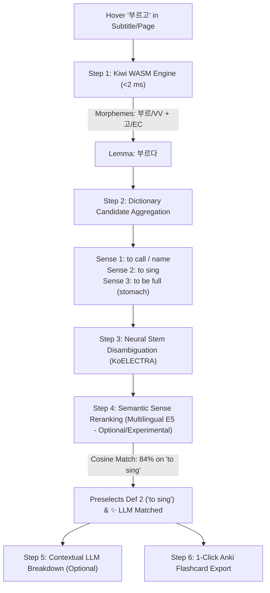

# Munmek (문맥) — Korean Context Lookup

**Munmek** is a Chromium browser extension for fast, context-aware Korean word lookups. It solves the language ambiguity and complex conjugations that make Korean difficult for learners. By combining a local offline termbank engine (supporting Yomitan / KRDICT imports), the native C++ **Kiwi** WebAssembly morphological analyzer, neural KoELECTRA candidate reranking, and an optional Multilingual E5 cross-lingual sense disambiguation model, Munmek provides instant, accurate dictionary headwords and definitions. It also features automated video subtitle extraction (Netflix, YouTube, ASBPlayer), adaptive multilingual LLM explanations, and 1-click AnkiConnect flashcard exports.

> [!NOTE]
> In its current vibe-coded state, this extension serves as a **proof of concept**. It is actively developed to explore high-performance offline Korean NLP in the browser.
> If you are looking for mature commercial tools, [Kimchi Reader](https://kimchi-reader.app/) and [Migaku](https://migaku.com/) are polished alternatives.
> Credits for the inspiring [blog post](https://kimchi-reader.app/blog/int8-cpu-korean-disambiguation) regarding the KoELECTRA INT8 Reranker go to Kimchi Reader's developer @Alanoor.

---

## Key Features

### ⚡ Full-Power Kiwi C++ WASM Morphological Engine
- **Native WebAssembly Sandbox**: Powered by `bab2min/Kiwi`, running offline in a Chrome Offscreen Document with sub-millisecond execution (<1–3 ms).
- **Comprehensive Sejong POS Tag Coverage**: Correctly processes all Korean part-of-speech classes:
  - **Predicates**: Verbs (`VV`), Adjectives (`VA`), Auxiliary Verbs (`VX`), Positive/Negative Copulas (`VCP`/`VCN`).
  - **Substantives**: General Nouns (`NNG`), Proper Nouns (`NNP`), Dependent Nouns (`NNB`), Numerals (`NR`), Pronouns (`NP`).
  - **Modifiers**: General Adverbs (`MAG`), Conjunctive Adverbs (`MAJ`), Determiners/Adnominals (`MM`), Interjections (`IC`).
  - **Particles (조사)**: Subject (`JKS`), Complement (`JKC`), Adnominal (`JKG`), Object (`JKO`), Adverbial (`JKB`), Vocative (`JKV`), Quotative (`JKQ`), Auxiliary/Topic (`JX`), Conjunctive (`JC`).
  - **Affixes & Roots**: Prefixes (`XPN`), Suffixes (`XSN`, `XSV`, `XSA`), Word Roots (`XR`).
- **Citation Base Form Recovery**: Restores canonical dictionary base forms for all Korean irregular verb/adjective classes:
  - 르-irregular (`불러` $\rightarrow$ `부르다`, `골라` $\rightarrow$ `고르다`)
  - ㄷ-irregular (`들어요` $\rightarrow$ `듣다`, `걸어서` $\rightarrow$ `걷다`)
  - ㅂ-irregular (`도와` $\rightarrow$ `돕다`, `부끄러워` $\rightarrow$ `부끄럽다`, `아름다워` $\rightarrow$ `아름답다`)
  - ㅅ-irregular (`지어서` $\rightarrow$ `짓다`, `나아요` $\rightarrow$ `낫다`)
  - ㅎ-irregular (`하얘` $\rightarrow$ `하얗다`, `파란` $\rightarrow$ `파랗다`)
  - ㅡ-irregular (`써서` $\rightarrow$ `쓰다`, `예뻐` $\rightarrow$ `예쁘다`)
  - ㄹ-irregular / ㄹ-drop (`사니`, `삽니다`, `사는` $\rightarrow$ `살다`)
- **Compound Predicate Synthesis & Sub-Verb Decomposition**:
  - Automatically synthesizes multi-part compound predicates (`데려다` + `주다` $\rightarrow$ `데려다주다`, `빠져` + `나가다` $\rightarrow$ `빠져나가다`).
  - Decomposes single-token compound verbs (`날아오르다` $\rightarrow$ `날다`, `오르다`) and presents constituent verbs in a dedicated `[관련]` sub-row.
- **Colloquial Copula Resolution**: Recovers base forms from contracted copular expressions (`말이야` $\rightarrow$ `말이다`, `거예요` $\rightarrow$ `것이다`).
- **Compound Noun Preservation**: Identifies compound nouns (`조타수`, `감시탑`, `조명탄`) while simultaneously providing root nouns (`감시`, `탑`) as selectable chips.
- **Pure-JS Layered De-Stacker Fallback**: Modular Hangul Jamo math (초성/중성/종성) providing fallback particle stripping, modal peeling (`-겠-`, `-았/었-`, `-시/셨-`), and connective ending deconjugations.

### 🧠 Neural Disambiguation & Semantic Reranking (Optional / Developer Mode)
- **Kiwi C++ WebAssembly Engine (Built-in)**:
  - Powered by bab2min's high-performance C++ morphological analyzer compiled to WebAssembly with bundled official language models (`cong.mdl`, 75.6 MB).
  - High-precision sentence-level statistical disambiguation, irregular verb recovery, compound verb decomposition, and particle separation out-of-the-box.
- **Stage 2 Multilingual E5 INT8 ONNX Reranker (~118 MB — Optional / Experimental)**:
  - Cross-lingual bi-encoder model for semantic definition sense disambiguation across English, Japanese, and other target languages.
  - Automatically highlights and pre-selects the winning definition tab based on sentence context.
  - Supports **WebGPU Hardware Acceleration** with automatic WASM SIMD CPU fallback.
  - Calibrated with Temperature-Scaled Softmax ($\tau = 0.06$) and Int8 quantization norm compensation.
  - Supports optional precomputed GPU vector imports (`.vec.bin`) for instant <5 ms offline sense matching.
  - **Lightweight Git Notice**: To keep the Git repository lightweight (<100 MB per file) and avoid Git LFS bandwidth quotas, this optional ~118 MB model is excluded from Git tracking. You can obtain it by downloading `multilingual_e5_small_int8.onnx` from [GitHub Releases](https://github.com/adrian-rossa/munmek/releases) into `lib/models/`, or generating it locally using `python scripts/export_multilingual_onnx.py`. Enable it anytime in Munmek Settings under **Developer Mode**.

### 🌐 Dynamic Multi-Dictionary & Multilingual Routing
- **Multi-Dictionary Tabs**: Import multiple Yomitan KRDICT dictionary `.zip` files (e.g. English, Japanese, French, Spanish) and tab between them seamlessly.
- **Automatic Language Detection**: Munmek detects the target language directly from the active dictionary tab (no manual settings dropdown required). ✨ LLM Matched` badges only attach to dictionary entries that match the language of the LLM response.

### 🎬 Site-Aware Media Context (Netflix & YouTube)
- **Netflix Direct Synopsis & Metadata**: Scrapes show titles, episode numbers, and direct plot synopsis straight from Netflix's DOM and media session metadata. Uses TMDB only as a secondary fallback with strict cache pollution guards.
- **YouTube In-Browser Transcript Parsing**: Extracts video details and caption tracks (JSON3/XML) directly in the browser without external dependencies like `yt-dlp`.
- **Token-Efficient Context Summarization**: Summarizes active scene context into a concise overview (~50 tokens) and injects it into LLM prompts for grounded explanations.

### 🎴 1-Click AnkiConnect Export
- Instant card creation in Anki Desktop via the local HTTP API (`http://127.0.0.1:8765`).
- Configurable deck selection, note types, and flexible placeholders (`{{word}}`, `{{base}}`, `{{surface}}`, `{{definition}}`, `{{sentence}}`, `{{hanja}}`, `{{grammar}}`, plus custom LLM JSON fields).
- Clean animated toast notifications confirming card creation or updates without distracting popup modals.

---

## Installation & Setup Guide

### 1. Prerequisites
- **Browser**: Google Chrome, Brave, Microsoft Edge, or any Chromium-based browser.
- **Anki Desktop** *(Optional, for card export)*: Anki running with the [AnkiConnect Add-on](https://ankiweb.net/shared/info/2055492159) (Code: `2055492159`).
- **AI Backend** *(Optional, for LLM explanations)*:
  - **Local AI / Custom Endpoint**: Run LM Studio (`http://localhost:1234/v1`), Ollama (`http://localhost:11434/v1`), llama.cpp server (`http://127.0.0.1:8080/v1`), or any OpenAI-compatible server. Completely private and offline. For responsible usage I recommend this option if you have the hardware to run a small LLM fast enough. A 2GB VRAM GPU should be enough to run a small and fast model like Gemma4
  - **Google Gemini**: Get a free API key from [Google AI Studio](https://aistudio.google.com/apikey).
- **asbplayer**: Browser Extension that provides highlightable and selectable Subtitles with Youtube, Netflix and more. Install it from the [Chrome Store](https://chromewebstore.google.com/detail/asbplayer-language-learni/hkledmpjpaehamkiehglnbelcpdflcab) or [Github](https://github.com/asbplayer/asbplayer). Highly recommended and essential for the anki card creation flow!

### 2. Installing the Extension
1. Clone or download this repository:
   ```bash
   git clone https://github.com/adrian-rossa/munmek.git
   ```
2. Open Chrome and navigate to `chrome://extensions/`.
3. Enable **Developer mode** using the toggle in the top-right corner.
4. Click **Load unpacked** and select the root directory of the `munmek` project.
5. Pin the **Munmek** icon in your browser toolbar.

### 3. Extension Configuration
Right-click the Munmek toolbar icon and select **Options** (or open `src/options/options.html`):

1. **Import Dictionaries**:
   - Download Yomitan-format KRDICT `.zip` archives (e.g., `KO-EN.KRDICT.No.Examples.zip`, `KO-JA.KRDICT.zip`). Compatible dictionaries are available [here](https://github.com/Lyroxide/yomitan-ko-dic/releases).
   - In Munmek Settings, click **Import Term Bank / Zip** and select the file.
   - Adjust priority order using **▲ Up** and **▼ Down** buttons.
2. **AI Backend Setup**:
   - Select **Custom OpenAI-Compatible Endpoint** (default: `http://localhost:1234/v1`) or **Google Gemini**.
   - Enter your model ID and API key (if required), then click **Test AI Connection**.
3. **AnkiConnect Setup**:
   - Ensure Anki is open with AnkiConnect enabled.
   - Click **Test Connection**, choose your target **Deck** and **Note Type**, and map Munmek placeholders to your note fields.
4. OPTIONAL: **Developer Mode & Optional Features (Stage 2 ONNX Reranking)**:
   - In Munmek Settings, check **Enable Developer Mode (Experimental Features)**.
   - If you wish to use the optional Stage 2 Multilingual E5 ONNX neural sense reranker:
     - Download `multilingual_e5_small_int8.onnx` from [GitHub Releases](https://github.com/adrian-rossa/munmek/releases) into `lib/models/`.
     - Or export it locally with `python scripts/export_multilingual_onnx.py`.
     - Check **Enable Stage 2 Definition Reranking & Confidence Scores**.
     - Optionally toggle **Enable WebGPU Hardware Acceleration** for instant GPU embeddings.

<details>
<summary>⚡ <strong>Offline Vector Precomputation Guide (Optional / GPU Accelerated)</strong></summary>

Precomputing definition vectors locally using your GPU accelerates Stage 2 sense reranking down to **<5 ms**, completely bypassing live ONNX neural inference during lookups.

1. **Install Python dependencies**:
   ```bash
   pip install -r scripts/requirements.txt
   ```
2. **Run GPU Precomputation**:
   ```bash
   python scripts/precompute_definition_vectors.py "path/to/KRDICT-KO-EN.zip"
   ```
3. **Import Vector Cache**:
   - In Munmek Settings under Developer Mode, click **"📥 Import Vector File"** next to your installed dictionary and select the generated `[dict_name]_vectors.vec.bin` file.
   - The badge **"⚡ Vector Cached"** will appear.

</details>

---

## Usage Guide

- **Start Session**: Click the Munmek icon in the browser toolbar:
  - **"▶ Start with Context"**: Activates hover lookups and automatically extracts/summarizes video subtitles, Netflix synopses, or page text.
  - **"⚡ Start (No Context)"**: Activates instant hover lookups without loading page context.
  - Active tabs display an **ON** badge on the extension icon.
- (Recommended for Youtube/Netflix:) **Start asbplayer**: Select the Tab playing the video with asbplayer to display selectable korean subtitles.
- **Hover Lookup**: Hold `Shift` (configurable) and hover over any Korean word on web pages or video subtitles (Netflix, YouTube, ASBPlayer).
- **Switch Candidates**: Click candidate chips in the tooltip (e.g. `[듣다]`, `[들다]`, `[동사]`, `[명사]`) to inspect alternative base forms or related sub-verbs.
- **Ask LLM**: Click `✨ Ask LLM` inside the tooltip for deep grammatical breakdowns and scene-grounded explanations in the language of the active dictionary.
- **Switch Dictionaries**: Click the dictionary tabs (`Dict: KRDICT EN`, `Dict: KRDICT JA`) to toggle between installed dictionaries. The action button automatically adapts to the selected language.
- **Export Flashcard**: Click **"Send to Anki"** or `+ Anki` on any specific definition to export a card. 
   Optionally update the last created card with a screenshot and audio using the asbplayer browser extension (Select "Update last card" Option in asbplayer settings under mining -> Mining button default action).
- **End Session**: Click **"⏹ Stop"** in the popup to disable lookups on the active tab or close the tab.

---

## How It Works: An Example Workflow (`부르고`)

To see how Munmek turns complex conjugated text into instant definitions, consider hovering over the word **`부르고`** in the subtitle sentence:

> **"아이들이 신나게 노래를 부르고 있다."** *(The children are joyfully singing a song.)*



1. **Step 1: Morphological Deinflection & Segmentation (Kiwi WASM Engine — <2 ms)**
   - The native C++ Kiwi engine runs offline in a WebAssembly sandbox inside a Chrome Offscreen Document.
   - It segments the surface token into its constituent morphemes: `부르` (Verb Stem `VV`) + `고` (Connective Suffix `EC`).
   - Recognizing irregular inflection patterns (e.g., 르-irregularity), Kiwi recovers the dictionary citation form (canonical headword): **`부르다`**.
   - Concurrently, Kiwi checks for compound verbs, auxiliary predicates, particle attachments, and copulas.

2. **Step 2: Candidate Extraction & Dictionary Aggregation**
   - Munmek queries your local IndexedDB termbanks (e.g. KRDICT English, KRDICT Japanese).
   - It retrieves all matching homonym entries and definition senses:
     - **Entry 1**: `부르다` (Verb: *to call someone*, *to name*)
     - **Entry 2**: `부르다` (Verb: *to sing [a song]*)
     - **Entry 3**: `부르다` (Adjective: *to be full [stomach]*)

3. **Step 3: Neural Stem Disambiguation (Stage 1 — KoELECTRA INT8)**
   - A lightweight INT8 ONNX KoELECTRA model (~14.3 MB) analyzes the Korean sentence context to rank candidate stems and confirm part of speech. This ensures surface forms with identical spellings or ambiguous stems (e.g. `듣다` vs `들다` for `들어요`, or `짓다` vs `지다` for `지어요`) are prioritized correctly.

4. **Step 4: Semantic Sense Reranking & Badge Matching (Stage 2 — Multilingual E5, Optional / Experimental)**
   - When enabled, the cross-lingual bi-encoder Multilingual E5 model (~118 MB) encodes the full sentence context alongside dictionary definition glosses in English, Japanese, or other languages.
   - It computes cross-lingual semantic similarity (accelerated via WebGPU when available).
   - It identifies **Sense 2 ("to sing")** as the winning semantic match (e.g. 84% confidence), automatically highlights and pre-selects that definition tab, and attaches the `✨ Matched` badge.

5. **Step 5: Contextual LLM Deep-Dive (Optional)**
   - Click **"✨ Ask LLM"** inside the tooltip.
   - Munmek automatically queries your configured AI (Local LLM or Gemini) in the language of the active dictionary tab (e.g. English for `KRDICT EN`, Japanese for `KRDICT JA`).
   - The LLM delivers scene-grounded nuance, honorific levels, and custom requested prompt fields (e.g. `cultural_context` or `hanja_breakdown`).

6. **Step 6: 1-Click Flashcard Export (AnkiConnect)**
   - Click **"Send to Anki"** to create a flashcard in Anki Desktop with word audio, sentence context, selected definition, and custom LLM fields, accompanied by instant toast confirmation.

---

## Architecture & Project Structure

```
munmek/
├── manifest.json              # Manifest V3 Extension Manifest
├── package.json               # Dependencies and Vitest test scripts
├── README.md                  # Project documentation & setup guide
├── LICENSE                    # MIT License
├── scripts/
│   ├── export_koelectra_onnx.py         # PyTorch KoELECTRA to INT8 ONNX exporter
│   ├── export_multilingual_onnx.py      # PyTorch Multilingual-E5 to INT8 ONNX exporter
│   ├── precompute_definition_vectors.py # DirectML GPU offline vector precomputator
│   └── requirements.txt                 # Python dependencies for vector tools
├── src/
│   ├── background/
│   │   └── background.js      # Service Worker (Offscreen lifecycle, AI routing, TMDB/Netflix context)
│   ├── content/
│   │   ├── content.js         # Core content script (Hover detection, DOM scraping, Range math)
│   │   ├── content_ui.js      # Tooltip UI renderer, dynamic action button, CJK typography
│   │   └── content.css        # Tooltip stylesheet
│   ├── nlp/
│   │   ├── kiwi_bridge.js     # Kiwi WASM bridge, beam search, POS-to-citation mapper
│   │   ├── korean_jamo.js     # Hangul alphabet decomposition/composition utility
│   │   ├── korean_lemmatizer.js # Rule-based particle stripper & verb de-conjugator
│   │   ├── korean_pipeline.js # Candidate generator orchestrator
│   │   ├── dictionary_db.js   # IndexedDB engine for fast offline dictionary queries
│   │   └── onnx_reranker.js   # Two-stage KoELECTRA + Multilingual E5 neural reranker module
│   ├── offscreen/
│   │   ├── offscreen.html     # Offscreen document HTML container
│   │   └── offscreen.js       # Offscreen document host (Kiwi WASM & ONNXRuntime-Web)
│   ├── options/
│   │   ├── options.html       # Extension settings UI
│   │   ├── options.js         # Settings controller & AnkiConnect field mapper
│   │   └── options.css        # Settings stylesheet
│   └── popup/
│       ├── popup.html         # Extension popup UI
│       ├── popup.js           # Session start/stop & context refresh controller
│       └── popup.css          # Popup stylesheet
├── lib/
│   ├── kiwi/                  # Kiwi WASM binary & model files (bab2min/Kiwi)
│   ├── models/                # KoELECTRA INT8 ONNX, Multilingual E5 INT8 ONNX & vocab
│   ├── onnx/                  # ONNXRuntime-Web engine & WordPiece tokenizer
│   └── jszip.min.js           # ZIP extraction library for termbank imports
└── test/                      # Vitest automated test suite (174 passing unit tests across 16 files)
```

---

## Development & Automated Testing

To run the automated test suite locally:

```bash
# Install dependencies
npm install

# Execute Vitest test suite
npx vitest run
```

The test suite covers:
- **Kiwi WASM Engine**: Full-power beam search, POS tag mappings, irregular deinflections, and compound predicate synthesis (`test/kiwi_full_power.test.js`, `test/kiwi_morphological_analyzer.test.js`).
- **Rule-Based Morpheme De-Stacker**: Hangul Jamo math, particle stripping, and ending deconjugations (`test/korean_lemmatizer.test.js`, `test/korean_lemmatizer_negative.test.js`).
- **Tooltip DOM Engine**: Single adaptive Ask/Refresh button, multi-dictionary language routing, ruby furigana rendering, HTML entity decoding, and Anki feedback (`test/content_ui.test.js`).
- **IndexedDB Termbanks**: Multi-dictionary priority queries and vector caching (`test/dictionary_db.test.js`).
- **Neural Disambiguation**: Stage 1 KoELECTRA candidate ranking and Stage 2 Multilingual E5 sense reranking (`test/koelectra_reranker.test.js`, `test/two_stage_neural_pipeline.test.js`, `test/synthetic_nlp_eval.test.js`).
- **Netflix & TMDB Context**: Direct synopsis extraction, TMDB search fallbacks, and anti-cache pollution safeguards (`test/netflix_tmdb.test.js`, `test/site_context_and_session.test.js`).
- **AI & AnkiConnect**: JSON schema parsing, dynamic custom prompt fields, and note template rendering (`test/custom_endpoint.test.js`, `test/custom_fields.test.js`, `test/background_template.test.js`).

---

## Credits & Technologies Used

Munmek is made possible thanks to the following open-source projects, models, and resources:

| Technology / Resource | Author / Provider | License | Usage in Munmek |
| :--- | :--- | :--- | :--- |
| [Kiwi (지능형 한국어 형태소 분석기)](https://github.com/bab2min/Kiwi) | bab2min | **LGPL-3.0** | WebAssembly Korean morphological analyzer & tokenizer |
| [KoELECTRA](https://github.com/monologg/KoELECTRA) | Park Jangwon (monologg) | **Apache 2.0** | Stage 1 candidate deinflection neural model |
| [Multilingual E5 Small](https://huggingface.co/intfloat/multilingual-e5-small) | Microsoft / Intfloat | **MIT** | Stage 2 cross-lingual definition sense neural model |
| [ONNXRuntime-Web](https://github.com/microsoft/onnxruntime) | Microsoft | **MIT** | Local WebAssembly neural inference engine |
| [JSZip](https://github.com/Stuk/jszip) | Stuart Knightley | **MIT / GPLv3** | ZIP archive unpacker for dictionary imports |
| [Google Gemini API](https://ai.google.dev/) | Google DeepMind | **API ToS** | On-demand sentence & grammar analysis |
| [AnkiConnect](https://github.com/FooSoft/anki-connect) | FooSoft | **GPLv3** | Anki desktop HTTP API integration |
| [KRDICT](https://krdict.korean.go.kr/) | National Institute of Korean Language | **CC-BY-SA 2.0 KR** | User-imported dictionary data source |

---

## License

This project is licensed under the **MIT License** — see the [LICENSE](LICENSE) file for details.
Third-party components like Kiwi (bab2min) are licensed under **LGPL-3.0** and operate in an isolated WebAssembly sandbox.

